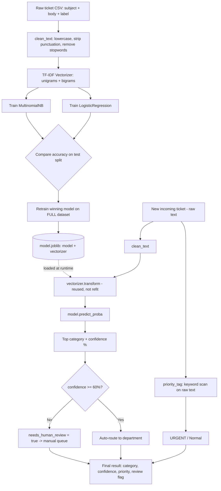

# Auto Email / Ticket Categorizer — Project Documentation

## 1. What It Does

Reads an incoming support ticket (subject + body text) and automatically routes it to one of **4 departments**: `Billing`, `Technical`, `HR`, `General`.

For every ticket it returns three things, not just a label:
- **Predicted category**
- **Confidence score** (probability %)
- **Priority tag** (`URGENT` / `Normal`, via keyword rules)

If confidence is too low, the ticket is **not** auto-assigned — it's flagged for a human to review instead. This mirrors how real enterprise helpdesk triage layers behave: fast auto-routing for clear cases, manual fallback for ambiguous ones.

---

## 2. File Structure

```
ticket_classifier/
├── data/
│   └── tickets.csv       # 40 labeled training tickets (10 per category)
├── train.py               # cleaning, TF-IDF, model training, evaluation, model selection
├── predict.py              # real-time classification: CLI demo + one-shot mode
├── model.joblib            # pre-trained pipeline (model + vectorizer), ready to use
├── README.md                # setup/usage instructions
└── REFLECTION.md             # what I'd improve with more data/time
```

---

## 3. System Design

Two independent stages, split across two scripts, connected by one artifact (`model.joblib`):

**Stage A — Offline training (`train.py`)**
Runs once (or whenever you want to retrain). Takes the labeled CSV, produces a trained model + fitted vectorizer, and serializes both together into a single file.

**Stage B — Online inference (`predict.py`)**
Runs per incoming ticket. Loads the serialized artifact (no retraining, no access to the CSV needed), transforms new raw text through the *same* fitted vectorizer, and returns a structured decision object.

This separation is the same shape as a production triage service: a batch/offline training job feeds a lightweight, fast inference path that a live queue can call synchronously.

```
        OFFLINE (train.py)                    ONLINE (predict.py)
   ┌───────────────────────────┐        ┌───────────────────────────┐
   │ data/tickets.csv          │        │ incoming ticket (raw text)│
   │ (labeled tickets)         │        └─────────────┬─────────────┘
   └─────────────┬─────────────┘                      │
                 ▼                                     ▼
        clean_text()                            clean_text()
                 │                                     │
                 ▼                                     ▼
     TfidfVectorizer.fit_transform          vectorizer.transform (reused)
                 │                                     │
     ┌───────────┴───────────┐                         ▼
     ▼                       ▼                 model.predict_proba()
MultinomialNB        LogisticRegression                 │
     │                       │                          ▼
     └──────────┬────────────┘              category + confidence
        pick best on test split                          │
                 │                                       ▼
      retrain best model on FULL data          confidence < 60%?
                 │                             ┌────────┴────────┐
                 ▼                            yes                no
     save {model, vectorizer}           needs_human_review   auto-route
        → model.joblib                                          │
                                                                  ▼
                                                    + priority_tag(raw_text)
                                                       (keyword rules,
                                                        independent path)
                                                                  │
                                                                  ▼
                                                     final structured result
```

---

## 4. Pipeline Visualization (flow diagram)



---

## 5. Pipeline Per File

### `train.py`
| Step | What happens |
|---|---|
| 1 | `load_data()` reads `data/tickets.csv` into a DataFrame |
| 2 | `clean_text()` applied to every row — lowercase, regex-strip anything that isn't a letter, collapse whitespace, drop a small manual stopword list |
| 3 | `train_test_split(test_size=0.25, stratify=category)` — keeps class balance in both splits |
| 4 | `TfidfVectorizer(ngram_range=(1,2), sublinear_tf=True)` fit on train text only |
| 5 | Fit **MultinomialNB** on TF-IDF vectors, predict on test set |
| 6 | Fit **LogisticRegression** (`max_iter=1000`) on the same vectors, predict on test set |
| 7 | Print accuracy, `classification_report` (precision/recall/F1 per class), confusion matrix — for **both** models |
| 8 | Pick whichever scored higher (ties → LogisticRegression) |
| 9 | Refit the vectorizer + the winning model on the **entire** dataset (train+test combined) — maximizes signal before deployment |
| 10 | `joblib.dump({"model":..., "vectorizer":..., "model_name":...})` → `model.joblib` |

### `predict.py`
| Step | What happens |
|---|---|
| 1 | `load_pipeline()` — loads `model.joblib`, unpacks model + vectorizer + model name |
| 2 | `classify(raw_text)` — runs `clean_text()` on the input, transforms with the **already-fitted** vectorizer (never refit at inference time) |
| 3 | `model.predict_proba()` → gets probability for every class, takes the max as the predicted category + confidence |
| 4 | `priority_tag(raw_text)` — scans the **raw, uncleaned** text against a keyword set (`urgent`, `down`, `crash`, `outage`, `not working`, etc.) — deliberately independent of the ML step |
| 5 | Builds a result dict: `category`, `confidence`, `priority`, `needs_human_review` (`True` if confidence < 0.60) |
| 6 | Two entry points: `run_cli()` for an interactive loop, or a one-shot call if ticket text is passed as a command-line argument |

---

## 6. Current Results

Test split: 10 tickets held out (25% of 40), stratified across all 4 classes.

| Model | Accuracy |
|---|---|
| MultinomialNB | 0.80 |
| LogisticRegression | 0.80 |

Per-class performance (both models, same test set) — `HR` was the weakest class, with recall of only 0.33 (2 of 3 HR test tickets got misrouted, one to General, one to Technical), while `Billing` was perfect on this small split.

**Selected for deployment: Logistic Regression** (tie-break rule — better-calibrated probabilities for the confidence-score feature).

This is a **small, hand-written dummy dataset** (40 tickets total) — the 80% accuracy number is illustrative of the pipeline working correctly, not a benchmark of real-world performance.

---

## 7. Real-Time Prediction — How to Use It

```bash
# One-shot: pass ticket text as an argument
python3 predict.py "My invoice shows double the amount I was quoted, please fix this"

# Interactive CLI: no argument, drops into a loop
python3 predict.py
> The app crashes every time I open it
> quit
```

**What you give as input:** just the raw ticket text — subject and body combined into one string, exactly as a real inbound email/ticket would read. No formatting, tagging, or preprocessing needed on your end — `clean_text()` handles that internally.

---

## 8. What Each Ticket Returns

Example:
```
Ticket: The production server is down right now, urgent, customers can't log in
  -> Category   : Technical  [LOW CONFIDENCE - ROUTED TO MANUAL REVIEW]
  -> Confidence : 37.4%
  -> Priority   : URGENT
```

| Field | Meaning |
|---|---|
| `category` | One of Billing / Technical / HR / General — the model's top prediction |
| `confidence` | Probability of that top prediction (0–100%) from `predict_proba()` |
| `priority` | `URGENT` or `Normal` — independent keyword-rule tag, not part of the ML decision |
| `needs_human_review` | `True` if `confidence < 60%` — ticket should go to a manual queue instead of auto-routing |

---

## 9. Design Rationale

| Choice | Reasoning |
|---|---|
| **TF-IDF, not raw Bag-of-Words** | Downweights common words automatically, upweights distinctive ones; `sublinear_tf=True` dampens the effect of word repetition in longer tickets |
| **Bigrams included** | Preserves short but meaningful phrases like "not working" or "still have" that would lose meaning as isolated unigrams |
| **Minimal, manual stopword list** (not sklearn's built-in) | A short list keeps words like "not" — which flips meaning — from being stripped; over-aggressive stopword removal hurts more than helps on short texts |
| **Both NB and LR trained, then compared** | Removes guesswork — let the held-out split decide instead of assuming one is better; also naturally satisfies "justify your model choice" rather than just importing one |
| **NB rationale specifically** | Strong baseline for short, sparse text where each category has a fairly distinct keyword vocabulary (billing vs. technical vs. HR barely overlap); trains instantly even on small data |
| **LR rationale specifically** | Models feature interactions better than NB's independence assumption, and produces better-calibrated probabilities — which matters directly for the confidence-score feature |
| **60% confidence threshold** | Mirrors real triage tools — an incorrect auto-route is more costly than a short delay for human review; 60% is a reasonable, easily-tunable starting point, not a derived constant |
| **Priority tagging as separate rule-based layer, not ML** | Transparent and instantly auditable — a human can see exactly why something got flagged urgent; also needs zero training data and is trivial to extend with new keywords |
| **Retrain on full data before saving** | The train/test split is only needed to *evaluate*; once you know which model is better, using 100% of available labeled data in production maximizes signal |

---

## 10. Limitations

- **Dummy dataset**: 40 hand-written tickets, 10 per class — not real customer data. Good for demonstrating the pipeline; not representative of real-world vocabulary diversity or class imbalance.
- **Diffuse confidence scores**: with so little training data, predicted probabilities stay spread across all 4 classes rather than concentrating sharply — so even *correctly* classified tickets often fall under the 60% threshold and get flagged for review. The fallback mechanism is working as designed, but it's currently doing more work than it should because the model isn't confident enough, not because tickets are genuinely ambiguous.
- **No "none of the above" class**: every ticket is forced into one of 4 buckets. A real queue also gets spam, test messages, or genuinely unclassifiable input — there's no dedicated class for that today; it just relies on falling under the confidence threshold.
- **HR class weakest performer**: on the 10-ticket test split, HR had the lowest recall (0.33) — most confusable with General and Technical given overlapping vocabulary like "process," "request," "documents."
- **No real-time queue integration**: this is a standalone script/CLI, not wired into an actual ticketing system (Zendesk, Freshdesk, etc.) — that would be the natural next step for a "live" deployment.
- **Static keyword list for priority**: urgency detection is a fixed set of keywords; it won't catch urgency expressed in ways not in that list (e.g., no exclamation-based or sentiment-based urgency detection).

---

## 11. To Run It Yourself

```bash
# 1. Install dependencies
pip install scikit-learn pandas joblib

# 2. Train (optional — model.joblib is already included pre-trained)
python3 train.py
# prints accuracy / precision / recall / confusion matrix for both models,
# then saves the winning model to model.joblib

# 3. Classify tickets
python3 predict.py "Can't log into my account, tried resetting password twice"     # one-shot
python3 predict.py                                                                   # interactive CLI
```

No API keys, no internet access, and no GPU required — everything runs locally with `scikit-learn`, `pandas`, and `joblib`.
